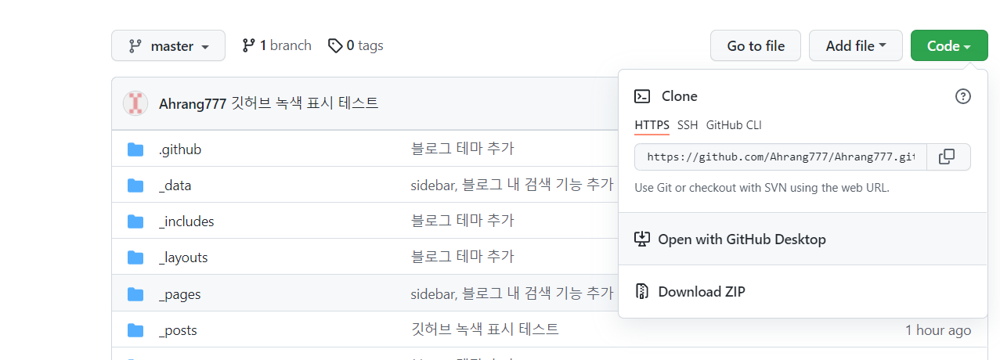
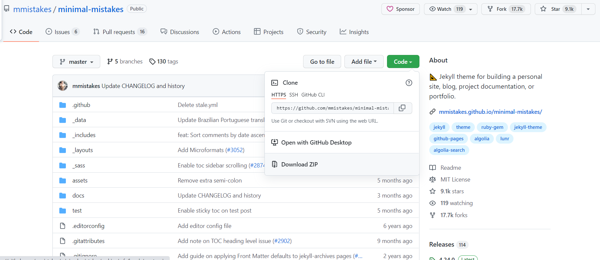

# 문제

## 상황

처음 깃허브 블로그를 만들고 다음날 글을 하나 올렸다. 정상적으로 깃허브에 반영이 되었지만 녹색으로 표시(잔디심기)가 되지 않았다. 

## 원인

나는 처음 https://github.com/mmistakes/minimal-mistakes 에서 fork 를 하여 나의 깃으로 가져온 후 이름을 변경하여 깃허브 블로그를 만들었다. 나중에 알아보니 fork를 한경우 내가 commit을 하고 push를 해도 깃에서 녹색 표시가 안된다는 사실을 알았다. pull request 로 표시할 수 있다고 하지만 나는 한번에 반영이 되었으면 하기에 다른 방법으로 깃 블로그를 다시 만들었다.

## 해결

### 과정 1

깃허브에 public  이고 본인아이디.github.io 로 레포지토리를 만든다. 

### 과정 2

레포지토리에서 녹색 'Code' 버튼을 누르고 Open with GitHub Desktop' 을 누른다. GitHub Desktop을 열리고 내가 원하는 장소에 clone을 한다.

### 과정 3

전체적인 테마를 선택한다. 나는 https://github.com/mmistakes/minimal-mistakes 를 선택하였다. 이 링크에서 Download ZIP 을 누르면 zip 파일로 저장이 된다.

### 과정 4

저장한 zip파일을 압축을 해제하고 내 pc에 저장했던 레포지토리 폴더에 압축 해제해서 나온 폴더들을 넣는다. 이후 내용은 fork로 깃허브 블로그를 만들었을때와 같다.

위와 같은 방법으로 깃허브 블로그를 만들고 확인해본 결과 제대로 반영이된다.

