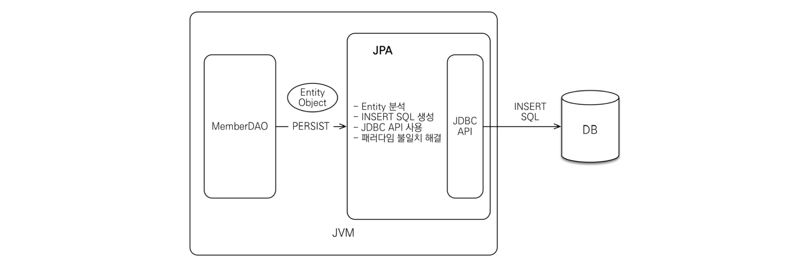

# ORM (Object-Relational Mapping)

객체와 DB 테이블을 매핑 시켜주는 프레임워크이다. 이를 통해 우리는 SQL 쿼리를 이용하는게 아닌 메서드 등을 이용하여 DB도 객체 지향적으로 프로그래밍 할 수 있다. 


# JPA

JPA는 Java Persistence API(자바 ORM 기술에 대한 API 표준 명세) 의 약자로 자바에서 ORM을 사용하기 위한 인터페이스의 모음이다. 인터페이스기 때문에 JPA만으로 사용할 수 없고 구현체가 필요하다.

## 동작과정


JPA는 애플리케이션과 JDBC 사이에서 동작한다. 개발자가 JPA를 사용하면 JPA 내부에서 JDBC API 를 사용하여 SQL을 호출하여 DB와 통신한다. 


**find**


개발자는 member의 PK를 JPA에게 넘겨준다. 

JPA는 

1. 엔티티의 매핑 정보를 바탕으로 적절한 SELECT SQL을 생성한다.
2. JDBC API를 사용하여 SQL을 DB에 날린다.
3. DB로부터 결과를 받아온다.
4. 결과(ResultSet)를 객체에 모두 매핑한다.
   쿼리를 JPA가 만들어 주기 때문에 Object와 RDB 간의 패러다임 불일치를 해결할 수 있다. 


**insert**



MemberDAO에서 객체를 저장하고 싶을때 개발자는 Member 객체를 JPA에게 넘긴다. 

JPA는

1. Member 엔티티를 분석한다.
2. INSERT SQL을 생성한다.
3. JDBC API를 사용하여 SQL을 DB에 날린다.


## 특징

- 데이터를 객체 지향적으로 관리할 수 있어서 개발자는 비즈니스 로직에 집중할 수 있다.
- 자바 객체와 DB 테이블 사이의 매핑 설정을 통해 SQL을 생성한다.
- 객체를 통해 쿼리 작성할 수 있는 JPQL(Java Persistence Query Language)를 지원
- JPA는 성능 향상을 위해 지연 로딩이나 즉시 로딩과 같은 몇가지 기법을 제공하는데 이것을 잘 활용하면 SQL을 직접 사용하는 것과 유사한 성능을 얻을 수 있다.


**지연 로딩(Lazy)**

객체가 실제로 사용될 때 로딩하는 전략이다. 

```java
Member member = memberDAO.find(memberId);
Team team = member.getTeam();
String teamName = team.getName();
```

memberDAO.find(memberId) 에서는 Member 객체에 대한 SELECT 쿼리만 날린다. 이후 Team 객체를 가져온 후 team.getName()처럼 값이 실제로 필요한 시점에 JPA가 Team에 대한 SELECT 쿼리를 날린다. 이 경우 Member, Team 객체 각각 따로 조회하기 때문에 네트워크를 2번 타게 된다. 


**즉시 로딩(Eager)**

```java
Member member = memberDAO.find(memberId);
Team team = member.getTeam();
String teamName = team.getName();
```

Member를 가져올때 연관된 모든 객체(Team)를 같이 가져온다. 


실무에선 대부분 LAZY로 해결한다.


<!-- JPA 사용이유  -->


# Spring Data JPA

JPA는 ORM을 위한 자바 표준이고 Spring Data JPA는 JPA를 쉽게 사용하기 위해 스프링에서 제공하고 있는 프레임워크이다. 


# Hibernate 

JPA 를 사용하기 위해서 JPA를 구현한 ORM 프레임워크 중 하나이다.


Hiberante을 사용함으로 JDBC 코드의 양을 최소화 할 수 있다. 우리는 객체 지향적으로 프로그래밍 하고 내부적으로 JDBC 코드가 자동으로 생성된다.


우리가 Hibernate API를 사용하면 JDBC API로 변환된다. 결국 Hibernate은 DB 사용을 위해 JDBC 코드를 사용한다. 


JDBC 는 DB에 접근할 수 있도록 자바에서 제공하는 API이다. DAO가  JDBC Driver로 구현이된 JDBC 인터페이스를 이용하여 DB에 접근한다. DataSource는 DB Connection 을 위한 설정이다. 이처럼 java data access를 위해선 jdbc를 사용해야하므로 Persistance Framework 도 결국엔 내부적으로 JDBC API를 이용한다. 


- SessionFactory

  세션을 만들어 DB와 communication

- hibernate.cfg.xml

  hibernate 설정

- *.hbm.xml class mappings

  객체와 테이블의 매핑관계 확인


## SessionFactory 객체

SessionFactory는 애플리케이션마다 1개만 존재한다.

SessionFactory 객체는 session 을 생성한다. Thread safe 한 객체이며 애플리케이션의 모든 스레드에서 사용된다. 무거운 객체라서 일반적으로 애플리케이션 시작 중에 생성이 되고 나중에 사용하기 위해 보관된다. 


## Session 객체

애플리케이션과 DB 간 communication, 일반적으로 Thread safe 하지 않아서 오랫동안 열어두면 안된다. 매핑된 entity class 의 객체에 대한 CRUD 를 제공한다. 

C : Create

R : Read

U : Update

D : Delete


매번 바로 DB에 기록하는것은 퍼포먼스에 영향을 주기때문에 캐시를 이용한다. 캐시를 이용하여 작업한 것들을 모았다가 한번에 DB에 반영한다.


### HQL(Hibernate Query Language) 

- SQL 과 유사하다

- 완전히 객체지향적이다. 
  - HQL은 table, column 이름을 사용하지 않고 class, property 이름을 사용한다. 

- keyword 에 대한 대소문자 구분 없다.
  - SQL에서 SELECT, select 가 구분이 없는것과 같다.

- Java class, property 에 대한 대소문자 구분이 있다. 
  - Person, person 은 다르다.


