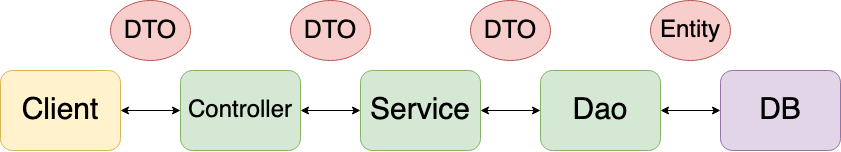

# DTO, VO, Entity, DAO 란?

## DTO

Data Transfer Object 의 약자로 계층간에 데이터를 전송하기 위한 목적으로 사용하는 객체이다. 목적 자체가 어떤 로직이 있다기 보다는 데이터를 넣고 꺼내는 getter, setter 정도만 갖는 단순히 데이터를 전달하는 용도로 사용된다.

## VO

Value Object의 약자로 상태가 있는 객체가 아니라 그저 값으로 취급하는 값 객체이다. getter과 로직을 포함할 수 있으며, 객체의 불변성을 보장한다. 

서로 다른 이름을 갖는 VO 객체라도 모든 속성 값이 같다면 두 인스턴스는 같은 객체라고 할 수 있다. 때문에 VO는 Object 클래스의 equals(), hashcode() 를 오버라이딩 해야한다. 

## Entity

실제 DB 테이블과 매핑되는 객체이다. 이를 기준으로 테이블이 생성되고 스키마가 변경된다. 그러므로 Entity를 요청이나 응답 값을 전달하는 클래스로 사용해서는 안된다. 

Entity는 id로 구분되고 로직을 포함할 수 있다. 

## DAO

DB를 사용하여 데이터를 조회하거나 조작하는 기능을 전담하는 객체이다. 

