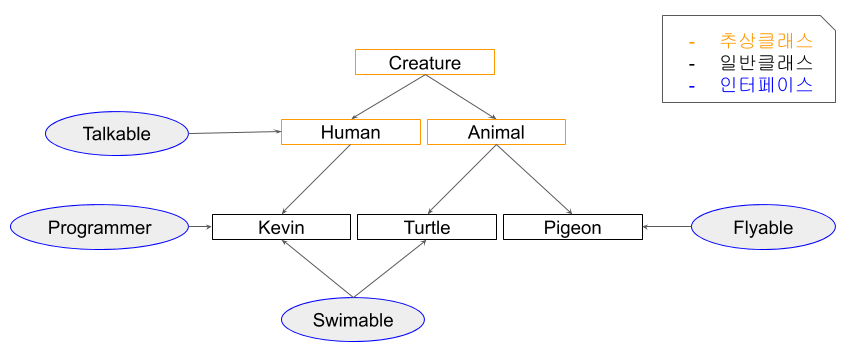

# 추상 클래스 (Abstract class)

추상 클래스는 상속을 통해 자손 클래스에서 완성하도록 유도하는 클래스이다. 그래서 **미완성 설계도** 라고도 표현한다. 

클래스 내에 추상 메서드(선언은 되어있으나 코드가 구현되지 않은 메서드)가 하나 이상 포함되거나 abstract 로 정의된 경우가 추상 클래스이다. 추상 클래스의 목적은 그 추상 클래스를 상속받아서 기능을 이용하고, 확장시키는데 있다. 


# 인터페이스 (Inerface)

인터페이스는 일종의 **규격**이다. 껍데기만 있는 형태로 이는 메서드 구현을 강제하기 위함이다. 구현을 강제함으로 구현 객체의 같은 동작을 보장할 수 있다. 

인터페이스의 모든 메서드는 추상 메서드이다. (자바 8에서 default 키워드로 일반 메서드 구현이 가능)


# 공통점

추상 클래스를 상속받는 클래스, 인터페이스를 구현하는 클래스에서 추상 메서드의 구현을 강제한다. 즉, 추상 메서드를 구현해야 한다는 말이다. 

참고: 추상 클래스를 상속 받을때 추상 메서드를 구현하지 않으면 상속받은 클래스도 추상 클래스가 된다.


# 차이점

앞의 내용만 봤을때는 추상 클래스가 인터페이스의 역할을 다 할 수 있는데 왜 굳이 인터페이스라는게 있는지 의문이 생긴다. 추상 클래스와 인터페이스로 나누어 사용하는 차이점은 다음과 같다.


## 1. 사용의도 차이

**추상 클래스는 '~ 이다. == is'**

**인터페이스는 '~을 할 수 있다. == has'**

자바의 경우 다중 상속이 불가능 하여 해당 클래스의 구분을 추상클래스 상속을 통해 해결하고, 할 수 있는 기능들을 인터페이스로 구현한다.


## 2. 공통된 기능 사용 여부

만약 모든 클래스가 인터페이스를 사용하여 기본 틀을 구성한다면 공통으로 필요한 기능들도 모든 클래스에서 재정의 해야하는 번거로움이 있다. (추상 클래스에서 상속받던 추상 메서드가 아닌 일반 메서드들을 생각해보자) 이처럼 공통된 기능들이 필요하다면 추상 클래스를 통해 일반 메서드를 작성하여 자식 클래스에서 사용하면 된다. 앞서 말했듯 다중 상속이 불가능하기 때문에 만약 각각 다른 추상 클래스를 상속하는데 공통된 기능이 필요하다면 해당 기능을 인터페이스로 작성하여 구현한다.


# 예제




**Creature 추상 클래스**

```java
public abstract class Creature {
    private int x;
    private int y;
    private int age;
    
    public Creature(int x, int y, int age) {
        this.age = age;
        this.x = x;
        this.y = y;
    }
    
    public void age() {
        age++;
    }
    
    public void move(int xDistance) {
        x += xDistance;
    }
    
    public int getX() {
        return x;
    }
    public void setX(int x) {
        this.x = x;
    }
    public int getY() {
        return y;
    }
    public void setY(int y) {
        this.y = y;
    }
    
    public abstract void attack();
    public abstract void printInfo();
    
    @Override
    public String toString() {
        return "x : " + x + ", y : " + y + ", age : " + age;
    }
}

```

기본적으로 생명체의 위치, 나이 를 선언하였고 attack(), printInfo() 는 **모든 생명체에게 필요한 기능이지만 각 생명체에 따라서 다른 기능으로 구현하기 위해 추상 메서드로 선언하였다.**


**Animal 추상 클래스**

```java
public abstract class Animal extends Creature{
    
    public Animal(int x, int y, int age) {
        super(x, y, age);
    }
    
    @Override
    public void attack() {
        System.out.println("몸을 사용하여 공격!!");
    }
}
```

동물은 생명체이기 때문에 Creature 추상 클래스를 상속하였고 attack() 추상 메서드를 구현하였다. printInfo() 를 구현하지 않아서 Animal 클래스도 추상 클래스이다.


**Human 추상 클래스**

```java
public abstract class Human extends Creature implements Talkable{
    public Human(int x, int y, int age) {
        super(x, y, age);
    }
    
    @Override
    public void attack() {
        System.out.println("도구를 사용!!");
    }
    
    @Override
    public void talk() {
        System.out.println("사람은 말을 할 수 있다.");
    }
}

```

Human 클래스도 Creature라는 추상 클래스를 상속받지만  printInfo() 라는 추상 메서드를 구현하지 않아서 여전히 추상 클래스이다. Human 의 경우 Talkable 인터페이스의 talk() 추상 메서드를 구현하였다.


**Talkable 인터페이스**

```java
public interface Talkable {
    abstract void talk();
}
```

talk() 라는 추상 메서드를 선언하였다.


**Flyable 인터페이스**

```java
public interface Flyable {
    void fly(int yDistance);
    void flyMove(int xDistance, int yDistance);
}

```

조류 동물 클래스에 구현시킬 인터페이스 이다. 


**Pigeon 일반클래스**

```java
public class Pigeon extends Animal implements Flyable{
    public Pigeon(int x, int y, int age) {
        super(x, y, age);
    }
    
    @Override
    public void fly(int yDistance) {
        setY(getY() + yDistance);
    }
    
    @Override
    public void flyMove(int xDistance, int yDistance) {
        setY(getY() + yDistance);
        setX(getX() + xDistance);
    }
    
    @Override
    public void printInfo() {
        System.out.println("Pigeon -> " + toString());
    }
}

```

Pigeon 은 조류라서 Flyable 인터페이스를 구현해주고 동물이기 때문에 Animal 추상 클래스를 상속하였다. Animal 추상 클래스에서 attack()은 구현을 해줬기에 추상 메서드가 printInfo() 하나 뿐이라 이것만 구현해주면 Animal 추상 클래스의 추상 메서드는 모두 구현한 것이다. 


#### Swimable 인터페이스

```java
public interface Swimable {
    void swimDown(int yDistance);
}
```

이 인터페이스는 앞서 설명한 차이점에서 **2. 공통된 기능 사용 여부**와 관련하여 설명이 가능하다. 앞의 전체적 구조도 그림을 보면 Turtle, Kevin 이라는 일반 클래스가 있다. Turtle은 말 그대로 거북이로 Animal 추상 클래스를 상속받고 Kevin은 사람으로 Human 추상 클래스를 상속받는다. 하지만 이 둘은 모두 수영을 할 수 있다는 공통된 기능을 필요로 한다. 이럴 경우 추상 클래스를 이용한다고 가정하면 swimDown() 메서드를 어디에 선언해야 할까? 동물이나 사람이나 수영을 할 수도 못 할 수도 있기에 어려움이 있다. 이런 경우 인터페이스를 이용하는 것이다. 인터페이스에서 추상 메서드로 선언을 해줘서 이 인터페이스를 Turtle, Kevin 에서 구현을 해주면 된다. 이렇게 인터페이스로 선언해주면 가독성, 유지 보수 측면에서 좋다.


**Turtle 일반클래스**

```java
public class Turtle extends Animal implements Swimable{
    public Turtle(int x, int y, int age) {
        super(x, y, age);
    }
    
    @Override
    public void swimDown(int yDistance) {
        setY(getY() - yDistance);
    }
    
    @Override
    public void printInfo() {
        System.out.println("Turtle -> " + toString());
    }
}

```


**Kevin 일반 클래스**

```java
public class Kevin extends Human implements Programmer, Swimable{
    public Kevin(int x, int y, int age) {
        super(x, y, age);
    }
    
    @Override
    public void coding() {
        System.out.println("Hello World!");
    }
    
    @Override
    public void swimDown(int yDistance) {
        setY(getY() - yDistance);
        if(getY() < -10) {
            System.out.println("너무 깊이 들어가면 죽을수도 있어!!");
        }
    }
    
    @Override
    public void printInfo() {
        System.out.println("Kevin -> " + toString());
    }
}
```

Kevin에서는 Turtle 클래스와는 다르게 swimDown()에서 깊이에 제한을 두는 식으로 오버라이딩 하였다. 또한 Kevin은 Programmer라는 인터페이스도 구현해주고 있다. 추상 클래스만 있다면 다중 상속이 불가능하여 불가능하지만 인터페이스를 이용하여 다중 구현을 해주고 있다.


**Programmer 인터페이스**

```java
public interface Programmer {
    void coding();
}
```


추상 클래스 : 상속 관계를 확인했을때 같은 조상 클래스를 상속하고 똑같은 기능이 필요한 경우 

ex) attack(), printInfo()

인터페이스 : 상속 관계를 확인했을때 다른 조상 클래스를 상속하는데 공통된 기능이 필요한 경우 사용

ex) swimDown()


참고 : https://myjamong.tistory.com/150
