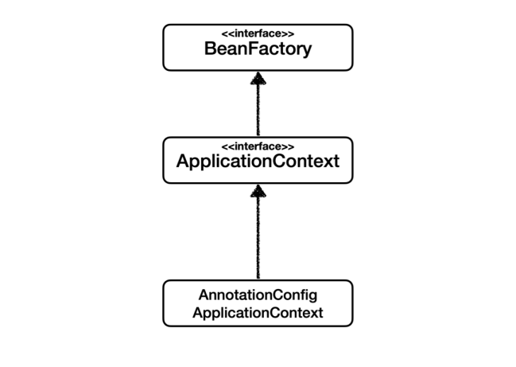
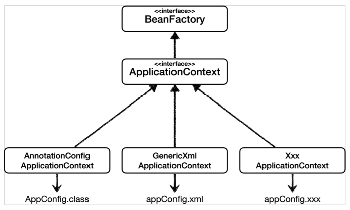

# 스프링 컨테이너

스프링 컨테이너는 스프링 빈을 생성하고 관리하는 컨테이너이다. 다음 예시에서 ApplicationContext 가 스프링 컨테이너이다. 스프링 컨테이너를 만들때는 예시의 AppConfig.class 같은 구성 정보를 지정해줘야 한다. 

```java
ApplicationContext ac = new AnnotationConfigApplicationContext(AppConfig.class);
```


## BeanFactory, ApplicationContext

스프링 컨테이너를 부를때는 앞서 나왔던 ApplicationContext 그리고 BeanFactory 로 구분해서 말한다. 




BeanFactory 인터페이스는 스프링 컨테이너의 최상위 인터페이스로 스프링 빈을 관리하고 조회하는 역할을 담당한다. 

ApplicationContext 는 BeanFactory 의 기능을 모두 상속받아서 제공하여 스프링 빈을 관리, 조회하고 여러 부가 기능들을 제공한다. (BeanFactory 뿐 아니라 MessageSource 인터페이스 등 여러 인터페이스를 추가로 상속받기 때문)

AnnotationConfigApplicatoinContext 는 ApplicationContext 인터페이스의 구현체이고 설정 정보로 어노테이션 기반 자바 코드 설정을 사용한다. 

이처럼 ApplicationContext 는 BeanFactory 뿐 아니라 여러 부가기능을 제공하여 주로 사용된다. 


## 다양한 설정 형식

앞서 말했듯 스프링 컨테이너 생성시 설정 정보가 필요한데 스프링 컨테이너는 다양한 형식의 설정 정보를 받아들일 수 있게 유연하게 설계되어 있다. 




**AppConfig: 어노테이션 기반 자바 코드 설정**

```java
@Configuration
public class AppConfig {

    @Bean
    public MemberService memberService(){
        return new MemberServiceImpl(memberRepository());
    }

    @Bean
    public OrderService orderService(){
        return new OrderServiceImpl(memberRepository(), discountPolicy());
    }

    @Bean
    public MemberRepository memberRepository(){
        return new MemoryMemberRepository();
    }

    @Bean
    public DiscountPolicy discountPolicy(){       
        return new RateDiscountPolicy();
    }
}
```


**appConfig.xml: xml 기반 설정**

```xml
<?xml version="1.0" encoding="UTF-8"?>
<beans xmlns="http://www.springframework.org/schema/beans"
       xmlns:xsi="http://www.w3.org/2001/XMLSchema-instance"
       xsi:schemaLocation="http://www.springframework.org/schema/beans http://www.springframework.org/schema/beans/spring-beans.xsd">

    <bean id="memberService" class="hello.corestudy.member.MemberServiceImpl">
        <constructor-arg name="memberRepository" ref="memberRepository"/>
    </bean>

    <bean id="memberRepository" class="hello.corestudy.member.MemoryMemberRepository"/>

    <bean id="orderService" class="hello.corestudy.order.OrderServiceImpl">
        <constructor-arg name="memberRepository" ref="memberRepository"/>
        <constructor-arg name="discountPolicy" ref="discountPolicy"/>
    </bean>

    <bean id="discountPolicy" class="hello.corestudy.discount.RateDiscountPolicy"/>

</beans>
```


# 스프링 빈

스프링 빈은 스프링 컨테이너에서 관리하는 자바 객체이다. 


## BeanDefinition

앞에서 알 수 있듯 스프링 컨테이너는 다양한 설정 형식을 지원한다. 어떻게 다양한 형식을 지원하는 걸까? 

BeanDefinition 덕분에 가능한 일이다. XML 형식이든 어노테이션 기반 자바코드 형식이든 상관없이 내용을 읽어 **BeanDefiniiton이라는 빈 설정메타 정보**를 만들고 스프링 컨테이너는 이 BeanDefinition을 기반으로 스프링 빈을 생성한다. 


*참고사항*

**스프링 컨테이너, 빈 생성**

1. 스프링 컨테이너 생성
2. 스프링 빈 생성
3. 의존관계 주입

생성자 주입의 경우 빈을 만들때 의존관계 주입도 일어나지만 필드주입, 수정자 주입, 메서드 주입의 경우 빈 생성과 의존관계 주입이 분리되어 있다. 


참고: https://www.inflearn.com/course/%EC%8A%A4%ED%94%84%EB%A7%81-%ED%95%B5%EC%8B%AC-%EC%9B%90%EB%A6%AC-%EA%B8%B0%EB%B3%B8%ED%8E%B8/dashboard