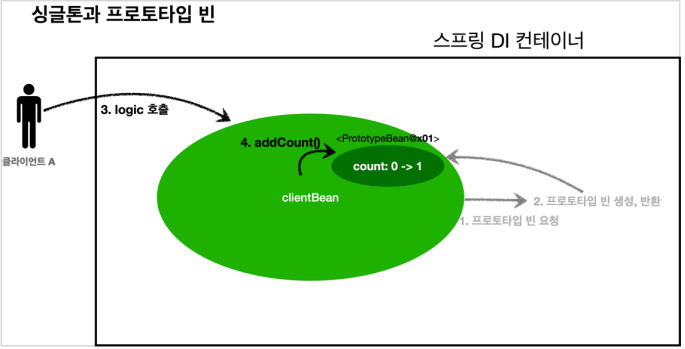
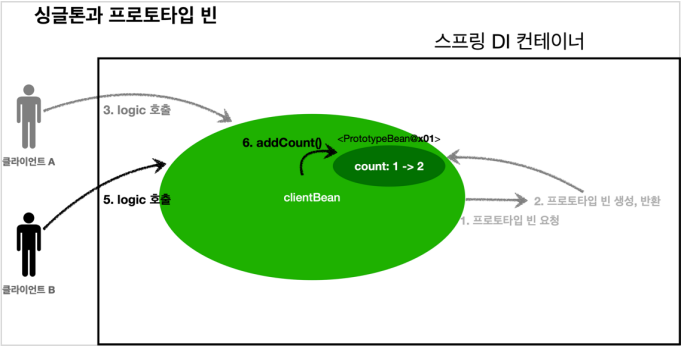

# 빈 스코프

## 싱글톤 빈

기본 스코프로 스프링 컨테이너 시작과 종료까지 유지되는 가장 넓은 범위의 스코프이다. 싱글톤이라는 이름 그대로 해당 스프링 빈은 하나만 생성이 되고 클라이언트의 요청에 대해서 이 하나의 스프링 빈이 공유된다. 

**스프링 컨테이너 생성 → 스프링 빈 생성 → 의존관계 주입 → 초기화 콜백 → 사용 → 소멸전 콜백 → 스프링 종료**


**싱글톤 빈 요청**

1. 싱글톤 스코프의 빈을 스프링 컨테이너에 요청한다.
2. 스프링 컨테이너는 관리하던 스프링 빈 반환
3. 스프링 컨테이너에 같은 요청이 와도 같은 객체 인스턴스의 스프링 빈을 반환한다. 


## 프로토타입 빈

스프링 컨테이너는 프로토타입 빈의 생성과 의존관계 주입까지만 관여하고 더는 관리하지 않는 매우 짧은 범위의 스코프이다. 프로토타입 빈은 싱글톤 빈과는 다르게 클라이언트로부터 요청이 들어오면 그때 생성이 되고 클라이언트에게 전달한다. 여기서 스프링 컨테이너는 **빈 생성, 의존관계 주입, 초기화 까지만 처리**하고 클라이언트에게 넘겨주며 더이상 해당 빈을 관리하지 않기때문에 @PreDestroy 같은 종료 메서드가 호출되지 않는다. 종료 메서드를 호출하고자 한다면 클라이언트에서 호출해 줘야 한다. 다음과 같이 프로토타입으로 지정한다. 

```java
@Scope("prototype")
@Bean

@Scope("prototype")
@Component
```


**프로토타입 빈 요청**

1. 프로토타입 스코프의 빈을 스프링컨테이너에 요청한다. 
2. 스프링 컨테이너는 이 시점에 프로토타입 빈을 생성하고, 필요한 의존관계를 주입한다.
3. 스프링 컨테이너는 생성한 프로토타입 빈을 클라이언트에 반환한다
4. 이후에 스프링 컨테이너에 같은 요청이 오면 항상 새로운 프로토타입 빈을 생성해서 반환한다.


# 프로토타입 빈 사용시 주의점

프로토타입 빈은 싱글톤 빈과 함께 사용될 때 문제가 발생한다. 만약 싱글톤 빈이 생성이 되고 의존관계 주입으로 프로토타입 빈이 주입되는 경우를 생각해보자. 의존관계 주입을 위한 프로토타입 빈이 스프링 컨테이너에 요청되고 그 때 프로토타입 빈이 생성이 되며 싱글톤 빈에 주입이 된다. 이런 상황에서 싱글톤 빈은 유일하고 프로토타입 빈은 싱글톤 빈에 주입이 된 후 더이상 주입되지 않기때문에 의도치 않게 싱글톤 빈에 묶여서 싱글톤 빈처럼 동작하게된다.




1. 클라이언트 A 는 clientBean을 스프링 컨테이너에 요청해서 받고 이 clientBean은 싱글톤이라서 항상 같은 clientBean이 반환된다. 

2. 클라이언트 A는 clientBean.logic() 호출한다.

3. clientBean은 prototypeBean의 addCount()를 호출하여 프로토타입 빈의 count를 1 증가시켜서 count의 값은 1이 된다. 




4. 클라이언트 B는 clientBean을 스프링 컨테이너에 요청해서 받고 이 clientBean은 싱글톤이라서 항상 같은 clientBean이 반환된다. 

- **clientBean의 내부에 가지고 있는 프로토타입 빈은 이미 과거에 주입이 끝난 빈이다. 주입 시점에 스프링 컨테이너에 요청해서 프로토타입 빈이 새로 생성된 것이지, 사용 할 때마다 새로 생성하는 것이 아니다.** 

5. 클라이언트 B는 clientBean.logic() 호출한다.

6. clientBean은 prototypeBean의 addCount()를 호출하여 프로토타입 빈의 count를 1 증가시켜서 count의 값은 2이 된다. (원래 원했던 것은 클라이언트 B의 호출결과도 1이 되는것)


```java
public class SingletonWithPrototypeTest1 {
	@Test
	void singletonClientUsePrototype() {
		AnnotationConfigApplicationContext ac = new AnnotationConfigApplicationContext(ClientBean.class, 														PrototypeBean.class);
		ClientBean clientBean1 = ac.getBean(ClientBean.class);
		int count1 = clientBean1.logic();
		assertThat(count1).isEqualTo(1);
		
        ClientBean clientBean2 = ac.getBean(ClientBean.class);
		int count2 = clientBean2.logic();
		assertThat(count2).isEqualTo(2);
	}
    
	static class ClientBean {
		private final PrototypeBean prototypeBean;
        
		@Autowired
		public ClientBean(PrototypeBean prototypeBean) {
			this.prototypeBean = prototypeBean;
		}
 
        public int logic() {
			prototypeBean.addCount();
			int count = prototypeBean.getCount();
			return count;
		}
	}
    
	@Scope("prototype")
	static class PrototypeBean {
		private int count = 0;
		public void addCount() {
            count++;
        }
        
        public int getCount(){
            return count;
        }
        
        @PostConstruct
        public void init(){
            System.out.println("PrototypeBean.init " + this);
        }
        
        @PreDestroy
        public void destroy(){
            System.out.println("PrototypeBean.destroy");
        }
    }
}
```


## 해결책 

이 문제의 해결책에 대한 핵심 키워드는 Dependency Lookup(DL) 이다. 의존관계를 외부에서 주입(DI) 받는게 아니라 필요한 의존관계를 직접 찾는 것을 DL, 의존관계 조회(탐색) 이라고 한다. 


## 1. ObjectFactory, ObjectProvider

지정한 빈을 컨테이너에서 대신 찾아주는 DL 서비스를 제공하는 것이 ObjectFactory 이고 ObjectProvider는 ObjectFactory에 여러 편의 기능을 추가한 것으로 최근에는 ObjectFactory가 아닌 ObjectProvider가 쓰인다. 

```java
import org.springframework.beans.factory.ObjectFactory;
import org.springframework.beans.factory.ObjectProvider;

static class ClientBean {
		@Autowired
    	private ObjectProvider<PrototypeBean> prototypeBeanProvider;
 
        public int logic() {
            PrototypeBean prototypeBean = prototypeBeanProvider.getObject();
			prototypeBean.addCount();
			int count = prototypeBean.getCount();
			return count;
		}
	}
```

이와 같이 수정하면 prototypeBeanProvider.getObject() 을 통해 항상 새로운 프로토타입 빈이 생성이 되는것을 확인 할 수 있다. ObjectProvider의 getObject() 를 호출하면 내부에서는 스프링 컨테이너를 통해 해당 빈을 찾아서 반환한다.(DL)

ObjectProvider의 경우 스프링이 제공하는 기술이지만, 기능이 단순하므로 단위테스트를 만들거나 mock 코드를 만들기는 훨씬 쉬워진다. 또한 ObjectProvider를 사용하는데 별도의 라이브러리는 필요없다. 


## 2. JSR-330 Provider

javax.inject.Provider라는 JSR-330 자바 표준을 이용하면 된다. 이를 이용하기 위해선 별도의 라이브러리를 gradle에 추가해야 한다. 

```java
import javax.inject.Provider;

static class ClientBean {
		@Autowired
    	private Provider<PrototypeBean> prototypeBeanProvider;
 
        public int logic() {
            PrototypeBean prototypeBean = prototypeBeanProvider.get();
			prototypeBean.addCount();
			int count = prototypeBean.getCount();
			return count;
		}
	}
```

Provider.get() 을 통해서 항상 새로운 프로토타입 빈이 생성되는 것을 확인할 수 있다. provider 의 get() 을 호출하면 내부에서는 스프링 컨테이너를 통해 해당 빈을 찾아서 반환한다. (DL) 

Provider는 자바 표준이고, 기능이 단순하므로 단위테스트를 만들거나 mock 코드를 만들기는 훨씬 쉬워진다. get() 메서드 하나로 기능이 매우 단순하고 별도의 라이브러리가 필요하며 자바 표준이라서 스프링이 아닌 다른 컨테이너에서도 사용할 수 있다. 


**참고**

ObjectProvider 과 같은 스프링이 제공하는 기술을 사용할지 JSR-330 Provider과 같은 자바 표준을 사용할지 고민이 될것 이다. 이 경우 ObjectProvider 는 DL을 위한 편의 기능을 많이 제공해주고 별도의 라이브러리가 필요없다. Provider는 별도의 라이브러리가 필요하지만 자바 표준이라서 다른 컨테이너에서 사용할 수 있다. 

ObjectProvider, Provider 만이 아니라 다른 경우에도 이처럼 기능이 겹칠때가 있다. **대부분 스프링이 더 다양하고 편리한 기능을 제공해줘서 특별히 다른 컨테이너를 사용할 일이 없다면 스프링이 제공하는 기능을 이용하면된다.** (사실상 스프링이 표준처럼 쓰여서 다른 컨테이너를 쓸 일이 많지도 않다.)
