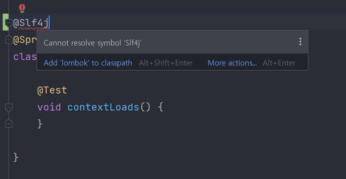
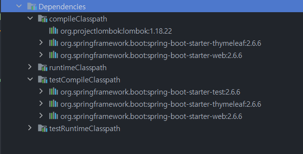
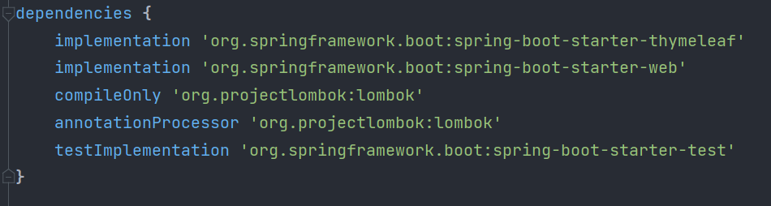
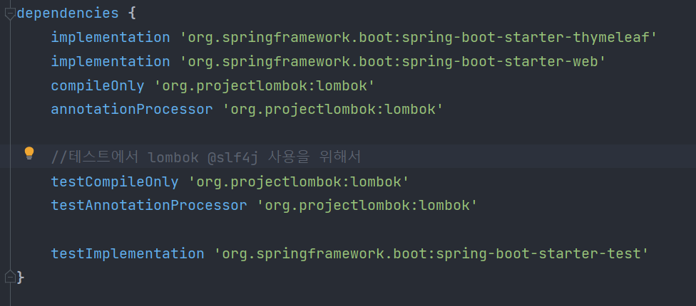
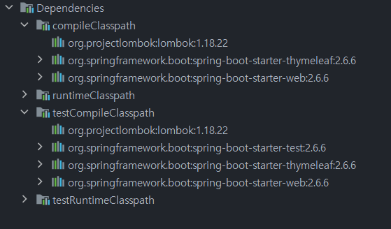

# Lombok 문제

스프링 부트의 Test 코드에서 @Slf4j 를 사용하려 했지만 다음과 같이 사용 할 수 없었다. 

## 원인

Dependencies의 Classpath 를 확인해 본 결과 compileClasspath 에만 lombok 이 있었고 testCompilepath에는 없었다. 때문에 Test 코드에서는 사용할 수 없었다. 

gradle의 dependencies를 보면 lombok이 testCompilepath 에 포함되지 않게 등록되어있다. 

**compileOnly 'org.projectlombok:lombok'**
**annotationProcessor 'org.projectlombok:lombok'**

## 해결책

가장 단순하게는 에러 표시에서 보이는 Add 'lombok' to classpath 를 누르면 해결된다. 

또는 gradle의 dependencies에 다음 내용을 추가하면 testCompilepath 에 lombok이 포함되서 해결된다. 

**testCompileOnly 'org.projectlombok:lombok'** 
**testAnnotationProcessor 'org.projectlombok:lombok'**

