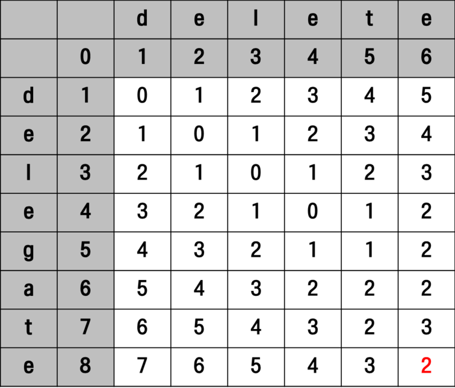

# 리벤슈테인 거리

러시아 과학자 블라디미르 리벤슈테인(Vladimir Levenshtein)가 고안한 알고리즘입니다. 편집 거리 (Edit Distance) 라는 이름으로도 불립니다. 문자열 A, B가 주어졌을 때 두 문자열이 얼마나 유사한 지를 알아낼 수 있는 알고리즘으로 문자열 A가 문자열 B와 같아지기 위해 몇 번의 연산을 진행해야 하는지 계산 할 수 있습니다. 

여기서 연산은 삽입(Insertion), 삭제(Deletion), 대체(Replacement)를 말합니다.


## 로직

1. 행가 열에 해당하는 두 문자가 서로 같다면, 왼쪽 위에 해당하는 수를 그대로 대임

2. 행과 열에 해당하는 문자가 서로 다르다면, 왼쪽(삽입), 위쪽(삭제), 왼쪽 위(교체)에 해당하는 수 중에서 가장 작은 수 + 1 한 값 대입


```java
	static String str1;
    static String str2;

    // 최소 편집 거리(Edit Distance) 계산을 위한 다이나믹 프로그래밍
    static int editDist(String str1, String str2) {
        int n = str1.length();
        int m = str2.length();

        // 다이나믹 프로그래밍을 위한 2차원 DP 테이블 초기화
        int[][] dp = new int[n + 1][m + 1];

        // DP 테이블 초기 설정
        for (int i = 1; i <= n; i++) {
            dp[i][0] = i;
        }
        for (int j = 1; j <= m; j++) {
            dp[0][j] = j;
        }

        // 최소 편집 거리 계산
        for (int i = 1; i <= n; i++) {
            for (int j = 1; j <= m; j++) {
                // 문자가 같다면, 왼쪽 위에 해당하는 수를 그대로 대입
                if (str1.charAt(i - 1) == str2.charAt(j - 1)) {
                    dp[i][j] = dp[i - 1][j - 1];
                }
                // 문자가 다르다면, 세 가지 경우 중에서 최솟값 찾기
                else { // 삽입(왼쪽), 삭제(위쪽), 교체(왼쪽 위) 중에서 최소 비용을 찾아 대입
                    dp[i][j] = 1 + Math.min(dp[i][j - 1], Math.min(dp[i - 1][j], dp[i - 1][j - 1]));
                }
            }
        }

        return dp[n][m];
    }

    public static void main(String[] args) throws IOException {
        BufferedReader bf = new BufferedReader(new InputStreamReader(System.in));
        str1 = bf.readLine();
        str2 = bf.readLine();

        // 최소 편집 거리 출력
        System.out.println(editDist(str1, str2));
    }
```


## 예시

문자열 **A가 'delegate'**, 문자열 **B가 'delete'** 라고 가정합니다. 문자열 A가 B와 동일해지기 위한 연산과정, 횟수는 아래와 같습니다.


문자열 A에서 5번 째 문자 g와 6번 째의 문자 a가 삭제되면 문자열 B가 동일해집니다. 즉, 여기서의 연산 횟수는 2가 됩니다.

아래 그림에서 0행 0열의 값이 0인데 이는 빈문자열 -> 빈문자열의 경우라서 그렇습니다.

0행과 0열의 빈칸은 각각 빈 문자열을 의미합니다.

행에 하나씩 있는 글자는 문자열 A(delegate)의 글자이고 열에 하나씩 있는 글자는 문자열 B(delete)의 글자





참고: https://madplay.github.io/post/levenshtein-distance-edit-distance
