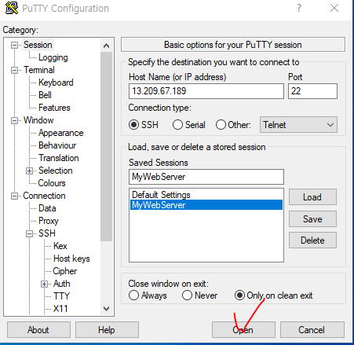

# Overview

AWS EC2 인스턴스를 생성하고 Spring Boot 서버를 띄워보는 것까지 진행합니다.

다음과 같은 순서로 진행합니다.

- EC2 인스턴스 생성
- putty를 이용한 EC2 접속
- Spring Boot 서버 띄우기


# 1. EC2 인스턴스 생성

[AWS 홈페이지](https://aws.amazon.com/ko/)에 접속해서 계정을 생성한 후 로그인 된 상태여야 합니다.


## 1.1 AWS Region 설정


위치를 서울로 설정합니다.

리전에 따라서 인스턴스 위치가 결정되기 때문에 외국으로 하면 속도가 느릴 수도 있습니다. 만약 대한민국이 아닌 다른 나라에 서비스 하려면 서비스하려는 나라의 도시를 선택해도 됩니다.


## 1.2 EC2 메뉴로 이동


## 1.3 키 페어 생성


키 페어는 EC2 서버에 SSH 접속을 하기 위해 필수라서 생성해야 합니다. 키 페어 메뉴에 들어가서 우측 상단의 키페어 생성을 누르면 생성할 수 있는 창이 나옵니다.

원하는 이름을 적고 키를 생성합니다. 저는 putty로 접속할 것이므로 .ppk 형태를 선택했습니다. 키 페어 생성을 누르면 my-key.ppk 가 다운받아지며 한번 다운받은 후에는 재다운 받을 수 없기 때문에 안전한 곳에 저장해둡니다.


## 1.4 보안그룹 생성


보안그룹 메뉴에 들어가서 보안그룹 생성을 누르면 보안그룹을 설정하는 창이 나옵니다. 원하는 이름을 적고 해당 보안그룹에 대한 설명을 적을 수 있습니다. 그리고 인바운드 규칙과 아웃바운드 규칙을 작성하고 보안그룹 생성을 누르면 새로운 보안그룹이 등록되는것을 알 수 있습니다. 저는 인바운드 규칙의 경우 putty를 통해 SSH 로 접속할 것이기에 22번 포트를 허용했고 HTTP, HTTPS 을 위한 80, 443포트, 스프링 부트를 위한 8080포트를 허용하였습니다. 아웃바운드 규칙은 모든 트래픽에 대해 허용했습니다. 인바운드 규칙과 아웃바운드 규칙은 설정해 준 내용에 대해선 허용하지만 그 외에 것들에 대해서는 허용하지 않습니다. 또한 IPv4 뿐 아니라 IPv6에 대해서도 설정할 수 있습니다.

**Inbound: 인스턴스에 들어오는 것에 대한 규칙**

**Outbound: 인스턴스에서 나가는 것에 대한 규칙**


## 1.5 새 인스턴스 생성


인스턴스 메뉴로 들어가 인스턴스 시작 버튼을 클릭합니다.


## 1.6 Amazon Machine Image(AMI) 및 인스턴스 유형 선택


AMI는 어떤 서버로 구성할지 선택하는 겁니다.

여러 종류가 있어서 원하는 걸 선택하면 되고, 저는 프리 티어에 Ubuntu LTS 버전을 선택했습니다.

*AWS Linux 는 CentOS로 Ubuntu와 명령어가 약간 다릅니다*

인스턴스 유형은 프리 티어를 사용한다면 다른 선택권이 없습니다.

스펙이 좋을수록 과금이 더 많이 되기 때문에 처음부터 좋은걸 고르기보다는 작게 시작했다가 스케일업 해나가는 걸 추천드립니다


## 1.7 키 페어 선택


전에 만들어둔 키 페어를 선택합니다. 새 키 페어 생성으로 EC2 인스턴스를 생성하며 새로운 키 페어를 만들어도 됩니다.


## 1.8 네트워크 및 스토리지 선택


위 그림처럼 EC2 를 생성하며 보안그룹을 만들거나 기존 보안 그룹 선택을 눌러서 전에 만들었던 보안그룹을 사용할 수 있습니다.


프리티어는 최대 30 까지 지원하기 때문에 해당 부분만 변경해줍니다.

볼륨 유형은 범용 SSD 로 선택해야 합니다.

만약 Provisioned IOPS SSD (프로비저닝된 IOPS SSD) 를 선택한다면 사용하지 않아도 활성화한 기간만큼 계속 비용이 발생하게 됩니다.


## 1.9 인스턴스 설정 요약


설정이 끝나면 우측에 지금까지 설정한 인스턴스 요약이 나옵니다. 문제가 없다면 인스턴스 시작을 눌러서 생성하면 됩니다.


## 1.10 인스턴스 생성 완료


처음 화면으로 돌아가면 인스턴스가 생성된 것을 확인할 수 있습니다.


# 2. putty를 이용한 EC2 접속

EC2에 접속하기 위해 putty를 통해 SSH로 접속하겠습니다.


## 2.1 퍼블릭 IPv4 주소 확인


생성한 EC2 인스턴스의 퍼블릭 IPv4 주소를 확인합니다.


## 2.2 putty 세팅


앞서 기억한 퍼블릭IPv4 주소를 Host Name에 등록합니다.

Saved Sessions에 세션을 저장하여 자동으로 실행되도록 등록합니다.


SSH 의 Auth에서 Private key를 등록합니다.

EC2 인스턴스를 생성할 때 받았던 .ppk 를 등록하면됩니다.


Connection 에서 다음과 같이 설정합니다.

주기적으로 null packet을 보내서 세션이 끊기지 않도록 설정합니다.




이제 설정이 완료되었다면 설정 내용을 Save하고 Open을 눌러서 실행하면 됩니다.


putty를 실행하고 저는 AMI가 Ubuntu 이기 때문에 login as에서 ubuntu 로 작성하시면 됩니다.

다른 AMI를 사용하시는 경우 아래를 참고해 주세요


**사용자** 이름에 AMI의 기본 사용자 이름을 입력합니다 .

- Amazon Linux 2 또는 Amazon Linux AMI의 경우 사용자 이름은 `ec2-user`입니다.
- CentOS AMI의 경우 사용자 이름은 `centos`또는 `ec2-user`입니다.
- Debian AMI의 경우 사용자 이름은 `admin`입니다.
- Fedora AMI의 경우 사용자 이름은 `fedora`또는 `ec2-user`입니다.
- RHEL AMI의 경우 사용자 이름은 `ec2-user`또는 `root`입니다.
- SUSE AMI의 경우 사용자 이름은 `ec2-user`또는 `root`입니다.
- Ubuntu AMI의 경우 사용자 이름은 `ubuntu`입니다.
- Oracle AMI의 경우 사용자 이름은 `ec2-user`입니다.
- Bitnami AMI의 경우 사용자 이름은 `bitnami`입니다.
- 그렇지 않으면 AMI 제공업체에 확인하십시오.


# 3. Spring Boot 서버 띄우기

배포 시스템 이런거 생략하고 진짜 단순하게 서버 띄우는 것만 확인해봅니다.

가장 간단한 방법은 두가지가 있는데 1번으로 진행하겠습니다.

1. **jar 파일을 빌드하여 EC2 복사 후 실행**
2. EC2 에서 프로젝트 git clone 후 실행


## 3.1 JDK 설치

```
# EC2 인스턴스
$ sudo apt-get update
$ sudo apt-get install openjdk-11-jdk
```

저는 스프링 부트에서 11버전을 사용할 것이기에 jdk를 11버전으로 설치했습니다.

`java -version` 으로 명령어로 설치 여부를 확인할 수 있습니다.


## 3.2 FileZilla를 통한 jar 파일 전송

FileZilla를 이용하면 jar 파일을 쉽게 EC2 인스턴스로 전송할 수 있습니다.


- 맨 위 표시된 버튼을 누르면 사이트 관리자가 뜹니다.

- New site를 눌러서 추가합니다.


- SFTP로 바꿔주고 호스트에는 EC2 인스턴스의 퍼블릭IP를 넣어줍니다.
- 저는 Ubuntu를 사용하기에 putty에서처럼 ubuntu를 입력해줍니다.
- 로그온 유형은 키 파일로 선택하고 키 파일에 AWS에서 받았던 .ppk 를 넣어줍니다.
- 연결.


왼쪽이 내 로컬 PC, 오른쪽이 EC2 인스턴스입니다.


EC2로 전송할 파일을 왼쪽에서 오른쪽으로 드래그 앤 드랍으로 옮겨주면 전송됩니다. putty를 통해 해당 파일이 전송되었음을 확인할 수 있습니다.


```
java -jar 파일이름.jar
```

위와 같은 명령어로 실행할 수 있습니다.


