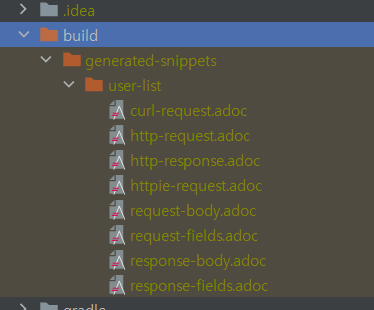
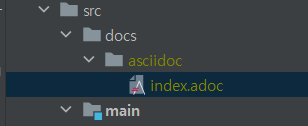

# Rest Docs

API 문서화를 위해서 Rest Docs 를 사용하게 되었고 이에 대한 정리를 한 글입니다.


## Why Rest Docs?

자바 문서화에서 주로 Swagger 와 Rest Docs 가 사용됩니다. 

|      | Rest Docs                           | Swagger                                |
| ---- | ----------------------------------- | -------------------------------------- |
| 장점 | 제품 코드에 영향 없다.              | API 를 테스트 해 볼 수 있다.           |
|      | 테스트가 성공해야 문서 작성이 된다. | 적용하기 쉽다.                         |
| 단점 | 러닝 커브가 있어서 적용하기 어렵다. | 제품코드에 어노테이션 추가를 해야한다. |
|      |                                     | 제품코드와 동기화가 안될수 있다.       |

Swagger 는 제품코드에 어노테이션을 추가하는 방식으로 동작합니다. 만약 제품코드를 수정하고 어노테이션을 수정하지 않을 경우 문서와 제품코드가 동기화 되지 않을 수 있습니다. 

반면 Rest Docs는 테스트 코드가 성공해야 문서 작성이 되기때문에 제품코드가 수정될 경우 해당 테스트 코드도 수정되어야 테스트 성공이 됩니다. 때문에 제품코드와 문서가 동기화가 됩니다. 또한 제품코드에 문서작성을 위한 어노테이션이 없기때문에 보기 편합니다. 

API 문서의 목적은 개발하는 스펙을 정의하는 것인데 Swagger의 경우 API 동작을 테스트 하는 용도에 더 특화 되어있습니다. 반면 Rest Docs는 깔끔 명료한 문서를 만들 수 있습니다.


## 1. 기본 설정

Gradle 7 + Spring Boot 2.7.2 + JUnit5 를 사용하는 환경에 적용시켰습니다. 


### build.gradle 설정

```
plugins {
	id 'org.springframework.boot' version '2.7.2'
	id 'io.spring.dependency-management' version '1.0.12.RELEASE'
//	id 'org.asciidoctor.convert' version '1.5.8'
	id 'org.asciidoctor.jvm.convert' version "3.3.2"	// gradle 7과 호환 문제때문
	id 'java'
}

group = 'com.project'
version = '0.0.1-SNAPSHOT'
sourceCompatibility = '11'

configurations {
	// 버전관련 추가된 내용
	asciidoctorExtensions

	compileOnly {
		extendsFrom annotationProcessor
	}
}

repositories {
	mavenCentral()
}

ext {
	set('snippetsDir', file("build/generated-snippets"))
}

dependencies {
	implementation 'org.springframework.boot:spring-boot-starter-data-jpa'

	// jwt 의존성
	implementation 'io.jsonwebtoken:jjwt:0.9.1'
	implementation 'org.springframework.boot:spring-boot-starter-security'
	implementation 'org.springframework.boot:spring-boot-starter-validation'
	implementation 'org.springframework.boot:spring-boot-starter-web'
	compileOnly 'org.projectlombok:lombok'
	developmentOnly 'org.springframework.boot:spring-boot-devtools'

	runtimeOnly 'org.mariadb.jdbc:mariadb-java-client'
	runtimeOnly 'com.h2database:h2'

	annotationProcessor 'org.projectlombok:lombok'
	testImplementation 'org.springframework.boot:spring-boot-starter-test'

	// 버전관련 추가된 내용
	asciidoctorExtensions 'org.springframework.restdocs:spring-restdocs-asciidoctor'
	testImplementation 'org.springframework.restdocs:spring-restdocs-mockmvc'
	testImplementation 'org.springframework.security:spring-security-test'
}

tasks.named('test') {
	outputs.dir snippetsDir
	useJUnitPlatform()
}

tasks.named('asciidoctor') {
	// 버전관련 추가된 내용
	configurations 'asciidoctorExtensions'
	inputs.dir snippetsDir
	dependsOn test
}

task copyDocument(type: Copy) {
	dependsOn asciidoctor

	from file("${asciidoctor.outputDir}")
	into file("src/main/resources/static/docs")
}

build {
	dependsOn copyDocument
}

```


`build/asciidoc` 에 html 파일을 `src/main/resources/static/doc` 에 복사하기 위해 아래 설정을 추가했습니다.

```java
task copyDocument(type: Copy) {
	dependsOn asciidoctor

	from file("${asciidoctor.outputDir}")
	into file("src/main/resources/static/docs")
}

build {
	dependsOn copyDocument
}
```


Gradle 버전 7은 문서 생성 과정에서 아래와 같은 에러가 발생합니다. 때문에 추가 설정을 했습니다. Gradle 버전 6를 이용하면 추가 설정 없이 사용가능합니다.

```
Some problems were found with the configuration of task ':asciidoctor' (type 'AsciidoctorTask').
  - In plugin 'org.asciidoctor.convert' type 'org.asciidoctor.gradle.AsciidoctorTask' method 'asGemPath()' should not be annotated with: @Optional, @InputDirectory.
```


`./gradle/wrapper/gradle-wrapper.properties` 에서 해당 프로젝트의 gradle 버전을 변경할 수 있습니다.

```
distributionBase=GRADLE_USER_HOME
distributionPath=wrapper/dists
distributionUrl=https\://services.gradle.org/distributions/gradle-6.9.1-bin.zip // 이 부분을 바꿔준다.
zipStoreBase=GRADLE_USER_HOME
zipStorePath=wrapper/dists
```


## 2. 테스트 코드 작성

```java
@RestController
@RequiredArgsConstructor
public class UserController {

    private final UserService userService;

    @PostMapping("/user")
    public UserResponseDto getName(@RequestBody UserRequestDto userRequestDto) {
        UserResponseDto resopnse = userService.convert(userRequestDto);
        return resopnse;
    }
}
```


```java
@Getter
@Setter
@Builder
@NoArgsConstructor
@AllArgsConstructor
public class UserRequestDto {
    private String name;
    private int age;
}
```


```java
@Getter
@Setter
@Builder
@NoArgsConstructor
@AllArgsConstructor
public class UserResponseDto {
    private String name;
}
```


```java
@Service
public class UserService {

    public UserResponseDto convert(UserRequestDto request) {
        return new UserResponseDto(request.getName());
    }
}
```


```java

@AutoConfigureMockMvc
@AutoConfigureRestDocs
@SpringBootTest
public class RestDocsTest {

    @Autowired
    private MockMvc mockMvc;

    @Autowired
    private ObjectMapper objectMapper;

    @MockBean
    private UserService userService;

    @Test
    @WithMockUser	// Spring Security 때문에 
    @DisplayName("Rest Docs 테스트")
    public void RestDocs_test() throws Exception {
        //given
        UserResponseDto response = UserResponseDto.builder().name("test").build();
        given(userService.convert(any(UserRequestDto.class))).willReturn(response);

        //when
        UserRequestDto request = UserRequestDto.builder().name("test").build();
        ResultActions result = this.mockMvc.perform(post("/user")	// 1
                .contentType(MediaType.APPLICATION_JSON)			// 2
                .content(objectMapper.writeValueAsString(request))	// 3
                .accept(MediaType.APPLICATION_JSON)					// 4
        );

        //then
        result.andExpect(status().isOk())
                .andDo(document("user-list",	// 5
                        requestFields(			// 6
                            // 7
                                fieldWithPath("name").type(JsonFieldType.STRING).description("User 이름"),
                                fieldWithPath("age").type(JsonFieldType.NUMBER).description("User 나이")
                        ),
                        responseFields(fieldWithPath("name").type(JsonFieldType.STRING).description("User 이름"))	// 8
                ));
    }
}
```

1. 요청 방식(get, post 등) 은 post 를 선택하고 /user 를 호출하겠다는 의미입니다.
2. 보내는 데이터가 application/json 형태라는 의미입니다.
3. RequestBody 를 받기 때문에 데이터를 보내줘야 합니다. 보내는 데이터를 입력해주면 됩니다.
4. 응답결과를 application/json 형태로 보냅니다.
5. documentation 이름을 "user-list" 로 하겠다는 의미입니다.
6. 이 요청은 requestFields를 받기 때문에 문서에 requestFields를 명시하겠다는 의미입니다.
7. `fieldWithPath`는 key 값을, `type`은 데이터 타입을, `description`는 `fieldWithPath`에 대한 설명을 쓰시면 됩니다.
8. 응답결과 데이터에 대한 설명입니다.


## 3. 테스트 수행 / Snippets 생성

작성된 테스트 케이스를 수행하고, 성공적으로 테스트가 완료되었다면, 아래와 같이 snippets 파일이 생성됩니다.




curl-request.adoc / http-request.adoc / http-response.adoc 등등의 조각파일이 생성됩니다. 


## 4. 문서 작성

gradle 기준 src/docs/asciidoc/index.adoc 디렉토리에 adoc 파일을 생성합니다(파일이름은 상관없습니다.) 

Gradle, Maven 에 따라 위치가 다르기 때문에 문서를 참고해야 합니다.





이 파일에서 http-request.adoc 와 같은 조각파일들을 이용하여 아래와 같이 문서를 작성합니다. 


```
ifndef::snippets[]
:snippets: ../../../build/generated-snippets
endif::[]

= API Document
:doctype: book
:icons: font
:source-highlighter: highlightjs
:toc: left
:toclevels: 3
:sectlinks:

[[introduction]]
== 소개

Spring Rest Docs API

[[common]]
== 공통 사항

API에 관계없이 아래 사항을 지켜주셔야 합니다.

=== Request
CURL:
include::{snippets}/user-list/curl-request.adoc[]

Request:
include::{snippets}/user-list/http-request.adoc[]

=== Response
Response:
include::{snippets}/user-list/http-response.adoc[]

```


adoc 파일로 문서작성이 끝났으면 build 를 합니다. build 결과로  

`build/asciidoc/index.html` 

`src/main/resources/static/doc/index.html`  생성됩니다.

마지막으로 서버를 실행시키고 http://localhost:8080/docs/index.html 로 이동하면 작성한 문서가 나오는 것을 확인 할 수 있습니다.


reference

[우아한형제들 기술 블로그](https://techblog.woowahan.com/2597/)

https://tecoble.techcourse.co.kr/post/2020-08-18-spring-rest-docs/

https://garve32.tistory.com/38