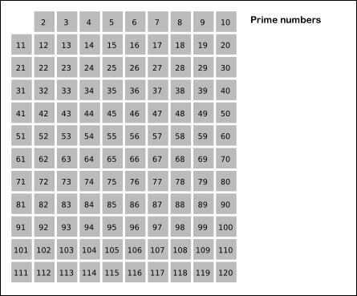

# 소수 찾기

[문제링크](https://school.programmers.co.kr/learn/courses/30/lessons/12921)

```
문제 설명
1부터 입력받은 숫자 n 사이에 있는 소수의 개수를 반환하는 함수, solution을 만들어 보세요.
소수는 1과 자기 자신으로만 나누어지는 수를 의미합니다.
(1은 소수가 아닙니다.)

제한 조건
n은 2이상 1000000이하의 자연수입니다.

입출력 예 #1
1부터 10 사이의 소수는 [2,3,5,7] 4개가 존재하므로 4를 반환
입출력 예 #2
1부터 5 사이의 소수는 [2,3,5] 3개가 존재하므로 3를 반환
```


## solution

에라토스테네스의 체 사용





1. 2부터 소수를 구하고자 하는 구간의 모든 수를 나열한다. 그림에서 회색 사각형으로 두른 수들이 여기에 해당한다.
2. 2는 소수이므로 오른쪽에 2를 쓴다. (빨간색)
3. 자기 자신을 제외한 2의 배수를 모두 지운다.
4. 남아있는 수 가운데 3은 소수이므로 오른쪽에 3을 쓴다. (초록색)
5. 자기 자신을 제외한 3의 배수를 모두 지운다.
6. 남아있는 수 가운데 5는 소수이므로 오른쪽에 5를 쓴다. (파란색)
7. 자기 자신을 제외한 5의 배수를 모두 지운다.
8. 남아있는 수 가운데 7은 소수이므로 오른쪽에 7을 쓴다. (노란색)
9. 자기 자신을 제외한 7의 배수를 모두 지운다.
10. 위의 과정을 반복하면 구하는 구간의 모든 소수가 남는다.

그림의 경우, **11² > 120**이므로 11보다 작은 수의 배수들만 지워도 충분하다. 즉, 120보다 작거나 같은 수 가운데 2, 3, 5, 7의 배수를 지우고 남는 수는 모두 소수이다. (11 이전의 수들만으로 이미 120까지 소수가 아닌것들이 모두 지워진다.)


```java
	static int findPrimeNumber(int n) {
        int answer = 0;
        // 소수는 false, 소수가 아닌 경우 true
        boolean[] prime = new boolean[n + 1];
        prime[0] = prime[1] = true;

        for (int i = 2; i * i <= n; i++) {
            // prime[i]가 소수라면
            if (!prime[i]) {
                // i배수는 소수가 아닌 처리, i * i 이전까지는 이미 처리한것
                // 예를 들면 i = 3일때 8까지는 이미 처리가 끝남
                // 2에서 2, 4, 6, 8 처리함 3, 5, 7은 소수
                // 이전 i값들을 통해 i * i 이전까지는 소수 아닌것들에 대한 처리가 끝난것
                for (int j = i * i; j <= n; j += i)
                    prime[j] = true;
            }
        }

        for (int i = 1; i <= n; i++) {
            if (!prime[i]) {
                answer++;
            }
        }

        return answer;
    }

    public static void main(String[] args) throws IOException {
        BufferedReader br = new BufferedReader(new InputStreamReader(System.in));
        int n = Integer.parseInt(br.readLine());

        System.out.println(findPrimeNumber(n));
    }
```


reference

[참고1](https://ko.wikipedia.org/wiki/%EC%97%90%EB%9D%BC%ED%86%A0%EC%8A%A4%ED%85%8C%EB%84%A4%EC%8A%A4%EC%9D%98_%EC%B2%B4)
