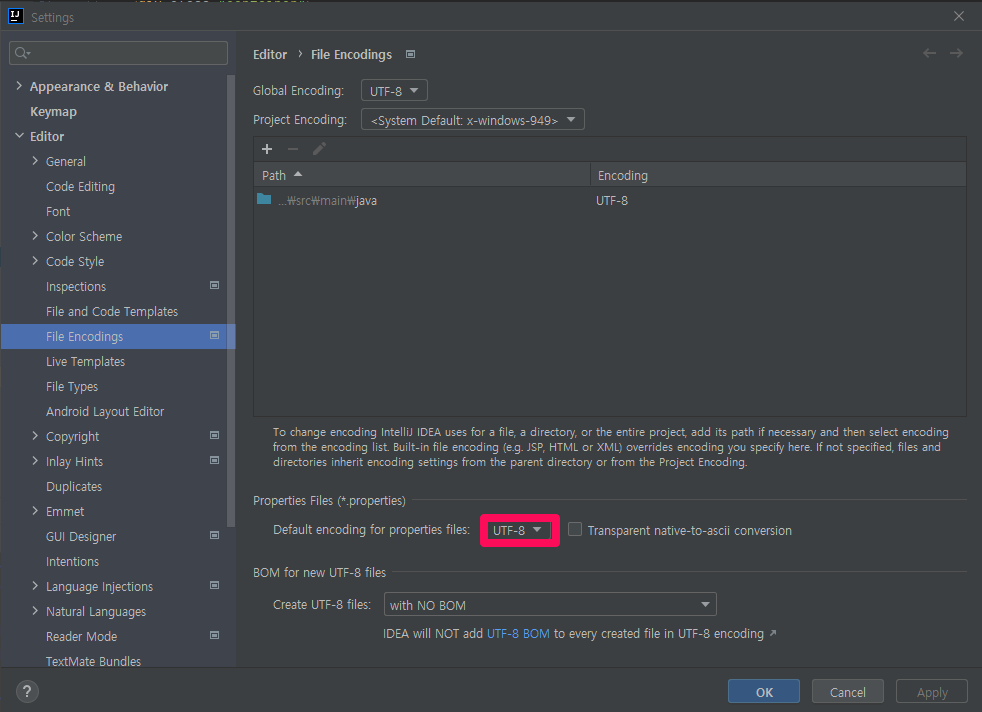

# 문제 상황

에러 메시지를 다국어 처리한 후 테스트를 해보니 한글이 깨져서 ??? 형태로 나오는 문제가 발생했습니다. 또한 이전에 한글로 제대로 작성했어도 어느순간 exception.properties 파일을 확인해보면 ??? 형태로 변경되어 있었습니다.

# 해결

[Settings] - [File Encodings] - Default encoding for properties files : UTF-8

이후 exception.properties 파일을 확인해서 ??? 로 변경되었던 내용을 다시 한글로 변경하고 실행시켜 보면 정상적으로 한글로 나오게 됩니다. 