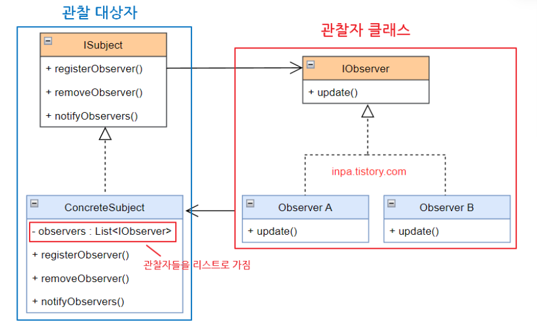
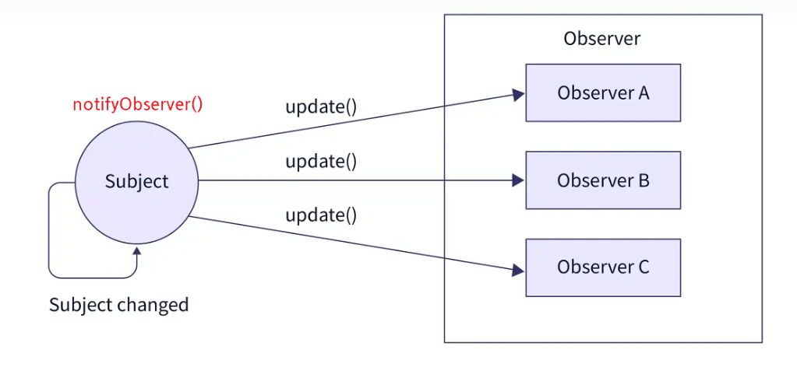
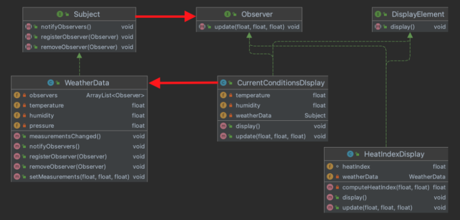

# 옵저버 패턴(Observer Pattern)이란?

한 객체의 상태가 바뀌면 그 객체에 의존하는 다른 객체들한테 연락이 가고 자동으로 내용이 갱신되는 방식으로 일대다 의존성을 정의합니다.

옵저버 패턴은 관찰자(Observer)들이 관찰하고 있는 대상자(Subject)의 상태 변화가 있을 때마다  대상자는 직접 각  관찰자들에게 통지하고, 관찰자들은 알림을 받아 조치를 취하는 행동 패턴입니다. 구독을 하면 관찰자가 되어 알림을 받을 수 있고 구독을 해지하면  더이상 알림을 받을 수 없습니다. 


# 구조



- ISubject: 관찰 대상자를 정의하는 인터페이스
- ConcreteSubject: 관찰 대상자(발행자, 게시자)
  - Observer 들을 Collection 형태로 모아 합성(composition)하고 있습니다. >> 위임
  - Subject는 관찰자인 Observer 들을 내부 Collection에 등록, 삭제할 수 있습니다.
  - Subject가 상태를 변경하거나 어떤 동작을 실행할 때, Observer 들에게 이벤트 알림(notify)을 발행합니다.
- IObserver: 관찰자(구독자)들을 묶는 인터페이스
- Observer: 관찰자 / 구독자 / 알림 수신자
  - Observer 들은 Subject 가 발행한 알림에 대해 현재 상태를 취득합니다.
  - Subject 의 업데이트에 대해 전후 정보를 처리합니다. 


# 흐름



1. 옵저버 패턴에서는 한개의 관찰 대상자(Subject)와 여러개의 관찰자(Observer A, B, C)로 일 대 다 관계로 구성되어 있습니다.
2. Observer 패턴에서는 관찰 대상 Subject의 상태가 바뀌면 변경사항을 옵저버한테 통보해줍니다. (notifyObserver)
3. 대상자로부터 통보를 받은 Observer는 값을 바꿀수도 있고, 삭제하는 등 적절히 대응합니다. (update)
4. 또한 Observer들은 언제든 Subject의 그룹에서 추가/삭제 될 수 있습니다. Subject 그룹에 추가되면 Subject로부터 정보를 전달받게 될 것 이며, 그룹에서 삭제될 경우 더이상 Subject의 정보를 받을수 없게 됩니다.


# 예시

WeatherData 라는 객체가 있고 WeatherData 에 새로운 측정값이 기록되면 measurementsChanged()가 호출되고 디스플레이(기상통계, 현재 기상조건, 기상 예보)에 새로운 정보를 담아 갱신합니다.

```java
measurementsChanged(){
    double temperature = getTemperature();
    double humidity = getHumidity();
    double pressure = getPressure();
    
	currentConditionsDisplay.update(temperature, humidity, pressure);
    statisticsDisplay.update(temperature, humidity, pressure);
    forecastDisplay.update(temperature, humidity, pressure);
}
```

단순하게 값들을 getter로 받아와서 update 해주도록 구현했다. 이럴 경우 다음과 같은 문제가 발생한다.

1) 구체적인 클래스를 사용하므로 다형성을 활용할 수 없고 동적으로 디스플레이를 추가, 제거할 수 없습니다.
2) 새로운 디스플레이가 추가될때마다 코드를 추가해줘야 해서 OCP에 위배됩니다. 


옵저버 패턴을 이용하면 이런 문제를 해결할 수 있습니다. 



```java
public interface Subject {
	void registerObserver(Observer observer);

	void removeObserver(Observer observer);

	void notifyObservers();	// Subject 객체의 상태 변경시 이를 모든 옵저버에게 알린다.
}

public class WeatherData implements Subject{
	private List<Observer> observers;
	private double temperature;
	private double humidity;
	private double pressure;

	public WeatherData() {
		this.observers = new ArrayList<>();
	}

	@Override
	public void registerObserver(Observer observer) {
		observers.add(observer);
	}

	@Override
	public void removeObserver(Observer observer) {
		if (observers.contains(observer)) {
			observers.remove(observer);
		}
	}

	@Override
	public void notifyObservers() {
		observers.forEach(observer -> observer.update(temperature, humidity, pressure));
	}

	public void measurementsChanged() {
		notifyObservers();
	}

	public void setMeasurements(double temperature, double humidity, double pressure) {
		this.temperature = temperature;
		this.humidity = humidity;
		this.pressure = pressure;
		measurementsChanged();
	}
}
```


```java
public interface Observer {
	void update(double temp, double humidity, double pressure);
}

public interface DisplayElement {
	void display();
}

public class CurrentConditionsDisplay implements Observer, DisplayElement {
	private Subject subject;
	private double temperature;
	private double humidity;

	public CurrentConditionsDisplay(Subject subject) {
		this.subject = subject;
		subject.registerObserver(this);
	}

	@Override
	public void display() {
		this.temperature = temperature;
		this.humidity = humidity;
		display();
	}

	@Override
	public void update(double temperature, double humidity, double pressure) {
		System.out.println("Current conditions: " + temperature + "F degrees and " + humidity + "% humidity");
	}
}
```


```java
public class main {
	public static void main(String[] args) {
		WeatherData weatherData = new WeatherData();
		Observer observer = new CurrentConditionsDisplay(weatherData);

		weatherData.setMeasurements(80, 65, 30.4);
		weatherData.setMeasurements(82, 70, 30.4);
		weatherData.setMeasurements(77, 77, 20.4);
	}
}
```

옵저버 패턴을 이용하면 느슨한 결합으로 Subject는 concrete observer에 대해 Observer 인터페이스를 구현하고 있다는 사실만 알고있고 Observer 에 그저 데이터만 전달할 뿐입니다. Observer를 확장하여 새로운 concrete observer 클래스를 구현한다고 해도 Subject는 변함이 없고 필요하다면 단지 Subject의 Observer로 등록하거나 제거하면됩니다. Subject와 Observer는 독립적으로 재사용 가능하고 변경사항이 서로 영향을 미치지 않습니다. 


느슨한 결합

- 느슨한 결합이란 **두 객체가 상호작용을 하지만, 서로에 대해 잘 모른다는 점**을 의미합니다.
- **인터페이스를 이용**하여 객체간의 느슨한 결합이 가능합니다.
- 상속을 통한 구현이 아닌 **구성(Composition)을 이용**해야 합니다.


# 장점

1. Subject 상태 변경을 주기적으로 조회하지 않고 자동으로 감지할 수 있습니다.
2. 느슨하게 결합되어 있기 때문에 Subject, Observer에서 변경사항이 생겨도 서로 영향을 주지 않습니다. 
3. OCP 원칙을 지킬 수 있습니다. 
4. 런타임 시점에 Subject, Observer 관계를 맺을 수 있습니다.


# 단점

1. Observer에게 알림이 가는 순서를 보장할 수 없습니다. 
2. 옵저버 패턴을 자주 구성하면 구조와 동작을 알아보기 힘들어져 코드 복잡도가 증가합니다.
3. 다수의 옵저버 객체를 등록 이후 해지하지 않는다면 메모리 누수가 발생할 수도 있습니다.


reference    

[참고1](https://blogshine.tistory.com/6)

[참고2](https://inpa.tistory.com/entry/GOF-%F0%9F%92%A0-%EC%98%B5%EC%A0%80%EB%B2%84Observer-%ED%8C%A8%ED%84%B4-%EC%A0%9C%EB%8C%80%EB%A1%9C-%EB%B0%B0%EC%9B%8C%EB%B3%B4%EC%9E%90#%ED%8C%A8%ED%84%B4_%EB%8B%A8%EC%A0%90)

