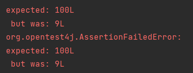

# 문제발생

spring boot, spring data jpa를 이용하여 프로젝트를 진행하였고 게시글 엔티티에 조회수(view_count) 필드를 만들어 게시글 상세조회를 할 때마다 조회수가 1씩 증가하는 형태로 구현하였습니다. 구현이 끝난후 게시글 조회의 경우 회원정보 변경처럼 명시적으로 자신의 정보를 변경하는 것이 아니고 여러 이용자가 조회하는 것 만으로 조회수 값이 변경되는데 여러 이용자가 동시에 하나의 게시글을 조회할 경우 제대로 반영이 안 될것 같다는 생각이 들었습니다. 관련 내용을 간략하게 테스트해보고 검색해 보니 실제로 동시성 문제가 발생한다는 사실을 알게되었습니다. **즉, 멀티 쓰레드 환경에서 다수의 요청(쓰레드)로 인해 DB 특정 로우에 동시에 접근하여 내용을 변경하면서 동시성 문제가 발생합니다.** 


# 테스트 코드

**<테스트 대상 코드>**

```java
@Entity
@Getter
@NoArgsConstructor(access = AccessLevel.PROTECTED)
public class Post {
	@Id
	@GeneratedValue(strategy = GenerationType.IDENTITY)
	private Long id;

	private String title;
	private String content;
	private Long viewCount = 0L;

	public Post(String title, String content) {
		this.title = title;
		this.content = content;
	}

	public void increaseViewCount(Long count) {
		viewCount += count;
	}
}


@Service
@Transactional
@RequiredArgsConstructor
public class PostService {
	private final PostRepository postRepository;

	public Long post(String title, String content) {
		Post post = postRepository.save(new Post(title, content));
		return post.getId();
	}

	public Long getPostDetails(Long id) {
		Post post = postRepository.findPostById(id).get();
		post.increaseViewCount(1L);
		return post.getViewCount();
	}
}

public interface PostRepository extends JpaRepository<Post, Long> {
	Optional<Post> findPostById(Long id);
}
```


**<테스트 코드>**

```java
@SpringBootTest
class PostServiceTest {
	private final int THREAD_CNT = 100;
	private ExecutorService ex = Executors.newFixedThreadPool(THREAD_CNT);
	private CountDownLatch latch = new CountDownLatch(THREAD_CNT);

	@Autowired
	private PostService postService;

	@Autowired
	private PostRepository postRepository;

	@Test
	void 동시성_테스트() throws Exception {
		// given
		Post post = postRepository.save(new Post("title", "content"));
		Long id = post.getId();

		// when
		for (int i = 0; i < 100; i++) {
			ex.execute(() -> {
				postService.getPostDetails(id);
				latch.countDown();
			});
		}

		// then
		latch.await();
		Post result = postRepository.findPostById(id).get();
		assertThat(result.getViewCount()).isEqualTo(100);
	}
}
```


**<테스트 결과>**



게시글을 100번 조회했기 때문에 조회수는 100이 될거라 예상했지만 실제로는 9만큼만 증가한 것을 확인할 수 있습니다. 


# 해결

동시성 문제를 해결하기 위해서는 잠금을 이용해야 합니다. 


## 낙관적 잠금(Optimistic Locking)

낙관적 잠금은 자원 경쟁을 낙관적으로 바라보기 때문에 다중 트랜잭션이 데이터를 동시에 수정하지 않는다고 가정합니다. 따라서 데이터를 읽을 때 Lock을 설정하지 않습니다. 읽는 시점에 Lock 을 설정하지 않았기 때문에 데이터를 수정한 시점에서 앞에서 읽은 데이터가 다른 사용자에 의해 변경되었는지 검사해야 합니다. 엔티티의 버전을 통해 동시성을 제어합니다. 즉, **어플리케이션 레벨에서 지원하는 락**입니다. 


### 장점

낙관적 잠금은 트랜잭션 충돌이 발생하지 않는다고 가정하므로 데이터를 읽을 때는 락을 설정하지 않습니다. 따라서 읽기에서 잠금을 사용하지 않는 만큼 성능이 좋습니다. 동시 업데이트가 없는 경우 이 방법을 이용하면 뒤에서 설명할 비관적 잠금보다 빠르게 조회 및 업데이트를 할 수 있습니다. 


### 단점

만약 여러 트랜잭션에서 작업 중 하나의 트랜잭션이 로우를 변경시킨다면, 다른 트랜잭션의 작업이 거부되어 오류 처리 혹은 재시도를 처리해야 합니다. 


### 적용

낙관적 잠금을 사용하려면 @Version을 적용한 필드가 엔티티에 있어야 합니다. 이 필드를 통해 엔티티 버전을 관리할 수 있습니다. 이를 사용하는 동안 데이터를 읽는 각 트랜잭션은 version의 값을 보유하고 트랜잭션이 업데이트를 수행하기 전에 version 값을 다시 확인합니다. 그 사이 값이 변경되면 ***ObjectOptimisticLockingFailureException* 이 발생합니다. 동일한 버전이면 트랜잭션이 업데이트를 커밋하고 버전 값을 증가시킵니다. **즉, 낙관적 잠금은 엔티티의 버전 값을 확인하여 엔티티 변경사항을 감지하는것을 기반으로 합니다.**


```java
@Entity
@Getter
@NoArgsConstructor(access = AccessLevel.PROTECTED)
public class Post {
	@Id
	@GeneratedValue(strategy = GenerationType.IDENTITY)
	private Long id;

	private String title;
	private String content;
	private Long viewCount = 0L;
    
    @Version
    private Integer version;

	public Post(String title, String content) {
		this.title = title;
		this.content = content;
	}

	public void increaseViewCount(Long count) {
		viewCount += count;
	}
}
```


#### @Version

낙관적 잠금을 활성화하는데 필요한 어노테이션 입니다. 버전관리를 위한 필드에 적용합니다. 버전 필드에는 다음과 같은 제한이 있습니다. 

- 각 엔티티 클래스에 버전 필드는 하나만 있어야 합니다. 
- 버전 필드의 데이터 타입은 *int* , *Integer* , *long* , *Long* , *short* , *Short* , *java.sql.Timestamp* 중 하나여야 합니다 .
- 버전의 값을 조회할 수 있지만 이를 직접 변경해서는 안됩니다.


## 비관적 잠금(Pessimistic Locking)

비관적 잠금은 자원 경쟁을 비관적으로 보기 때문에, 다중 트랜잭션이 데이터를 동시에 수정할 것으로 가정합니다. 따라서 하나의 트랜잭션이 데이터를 읽는 시점에서 락을 걸고, 조회 또는 갱신 처리가 완료될 때 까지 유지하여 다른 트랜잭션에서 접근하지 못하도록 합니다. 조회 때 락을 획득하는 방법은 대표적으로 SELECT ... FOR UPDATE 입니다. 이 쿼리를 통해 조회된 해당 로우는 잠금을 획득하여 해당 트랜잭션이 끝나기 전까지 다른 트랜잭션은 접근하지 못하고 대기해야 합니다. **즉, 비관적 락은 데이터베이스 레벨에서 지원하는 락입니다.**


### 적용

```JAVA
public interface PostRepository extends JpaRepository<Post, Long> {
	@Lock(LockModeType.PESSIMISTIC_WRITE)
	Optional<Post> findPostById(Long id);
}
```


### 잠금 모드

- PESSIMISTIC_READ: 공유잠금을 확보하고 데이터가 업데이트 되거나 삭제되는 것을 방지할 수 있습니다. 
- PESSIMISTIC_WRITE: 배타적 잠금을 확보하고 데이터를 읽거나 업데이트하거나 삭제하는 것을 방지할 수 있습니다.
- PESSIMISTIC_FORCE_INCREMENT: PESSIMISTIC_WRITE 처럼 작동하며 버전이 지정된 엔터티의 버전 특성을 추가로 증가시킵니다.


### 장점

트랜잭션의 동시 접근을 확실하게 방지할 수 있습니다.


### 단점

트랜잭션이 완료되기 전까지 다른 트랜잭션이 접근하지 못해서 동시성이 떨어져 대기가 길어지고 성능이 떨어질 수 있습니다. 또한 자원을 점유한 채, 서로의 자원을 요청하는 데드락 상황이 발생할 수 있습니다.


## 어떤 잠금을 사용해야 할까?

회원정보 변경처럼 트랜잭션 충돌이 발생할 확률이 적은 경우 낙관적 잠금 처리를 하는 것이 좋아보입니다. 하지만 조회수 증가처럼 트랜잭션 충돌 문제가 발생할 확률이 높은 경우 낙관적 잠금을 적용하면 이에 대한 복구작업을 많이 해야하고 이 경우 비관적 잠금을 사용하는 것이 맞다고 생각합니다. 때문에 저는 조회수 증가에 비관적 잠금을 적용하였습니다.


reference    

[참고1](https://escapefromcoding.tistory.com/727#%EB%B9%84%EA%B4%80%EC%A0%81-%EC%9E%A0%EA%B8%88pessimistic-lock)

[참고2](https://www.baeldung.com/jpa-optimistic-locking)

[참고3](https://www.baeldung.com/jpa-pessimistic-locking)

