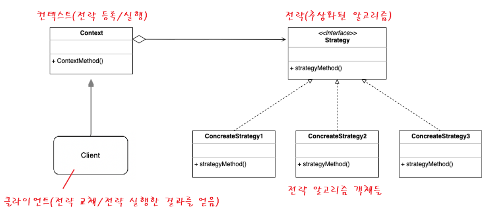

# 전략 패턴(Strategy Pattern)이란?

전략 패턴은 실행(런타임) 중에 알고리즘 전략을 선택하여 객체 동작을 실시간으로 바뀌도록 할 수 있게 하는 행위 디자인 패턴입니다. 

전략이란 알고리즘, 기능, 동작 등 특정 목표를 수행하기 위한 행동 계획입니다. 


# 구조



- Strategy : 전략 구현체에 대한 인터페이스
- ConcreteStrategy : 알고리즘, 행위, 동작을 정의한 구현체
- Context : 전략을 등록, 실행합니다. 전략을 실행해야 할때 등록된 전략의 메소드를 호출하도록 위임합니다. 
- Client : 특정 전략을 Context에 등록, 변경하여 전략을 실행한 결과를 얻습니다.


**참고**

프로그래밍에서의 컨텍스트(Context) 란 콘텐츠(Contetns)를 담는 그 무엇인가를 뜻하며, 어떤 객체를 핸들링 하기 위한 접근 수단입니다.
즉, 물컵에 물이 담겨있으면 물은 콘텐츠가 되고, 물컵은 컨텍스트가 되며, 물을 핸들링 하기 위한 접근 수단이 됩니다.


# 구현

```java
public interface IStrategy {
	void doSomething();
}

public class ConcreteStrategyA implements IStrategy{
	@Override
	public void doSomething() {
		System.out.println("Strategy A");
	}
}

public class ConcreteStrategyB implements IStrategy{
	@Override
	public void doSomething() {
		System.out.println("Strategy B");
	}
}

public class Context {
	private IStrategy strategy;

	public void setStrategy(IStrategy strategy) {
		this.strategy = strategy;
	}

	public void doSomething() {
        // 공통 로직
        
		strategy.doSomething();
	}
}

public class Client {
	public static void main(String[] args) {
		Context context = new Context();

		context.setStrategy(new ConcreteStrategyA());
		context.doSomething();

		context.setStrategy(new ConcreteStrategyB());
		context.doSomething();
	}
}
```


# 특징


## 패턴 사용 시기

- 다양한 전략 알고리즘이 필요할 때 클래스화를 통해 관리합니다.
- 알고리즘 동작이 런타임에 실시간으로 교체 되어야 할 때 사용합니다. 


## 장점

- 공통 로직이 Context에 있기 때문에 구현체들에 대한 영향도가 적습니다. 
- 구체적인 클래스가 아닌 Strategy라는 인터페이스를 의존하기때문에 변경이 쉽고 OCP를 지킬 수 있습니다. 


## 단점

- 알고리즘이 증가할때마다 구현 클래스가 증가하여 관리할 대상이 많아집니다.


# 예제1

```java
@Setter
public class Robot {
	private MoveStrategy moveStrategy;
	private TranslateStrategy translateStrategy;

	public Robot(MoveStrategy moveStrategy, TranslateStrategy translateStrategy) {
		this.moveStrategy = moveStrategy;
		this.translateStrategy = translateStrategy;
	}

	public void move() {
		moveStrategy.move();
	}

	public void translate() {
		translateStrategy.translate();
	}
}

public interface MoveStrategy {
	void move();
}

public class Walk implements MoveStrategy {
	@Override
	public void move() {
		System.out.println("걷기");
	}
}

public class Run implements MoveStrategy {
	@Override
	public void move() {
		System.out.println("뛰기");
	}
}

public interface TranslateStrategy {
	void translate();
}

public class Korean implements TranslateStrategy {
	@Override
	public void translate() {
		System.out.println("한국어 번역");
	}
}

public class Japanese implements TranslateStrategy {
	@Override
	public void translate() {
		System.out.println("일본어 번역");
	}
}

public class Client {
	public static void main(String[] args) {
		Robot robot = new Robot(new Walk(), new Korean());
		robot.move();
		robot.translate();

		robot.setMoveStrategy(new Run());
		robot.setTranslateStrategy(new Japanese());

		robot.move();
		robot.translate();
	}
}
```


# 예제2

기존 Strategy 패턴과 조금은 다른 형태로 Strategy 를 필드로 합성(composition)하지 않고 pay() 메소드의 매개변수로 받는 형태입니다.

```java
public class ShoppingCart {
	private List<Item> items = new ArrayList<>();

	public void addItem(Item item) {
		this.items.add(item);
	}

	public void pay(PaymentStrategy paymentMethod) {
		int amount = 0;
		for (Item item : items) {
			amount += item.getPrice();
		}
		paymentMethod.pay(amount);
	}
}

@Getter
public class Item {
	private String name;
	private int price;

	public Item(String name, int price) {
		this.name = name;
		this.price = price;
	}
}

public interface PaymentStrategy {
	void pay(int amount);
}

public class KakaoCardStrategy implements PaymentStrategy {
	private String name;
	private String cardNumber;
	private String cvv;
	private String dateOfExpiry;

	public KakaoCardStrategy(String name, String cardNumber, String cvv, String dateOfExpiry) {
		this.name = name;
		this.cardNumber = cardNumber;
		this.cvv = cvv;
		this.dateOfExpiry = dateOfExpiry;
	}

	@Override
	public void pay(int amount) {
		System.out.println(amount + "원 paid by kakao card");
	}
}

public class LunaCardStrategy implements PaymentStrategy {
	private String emailId;
	private String password;

	public LunaCardStrategy(String email, String pwd) {
		this.emailId = email;
		this.password = pwd;
	}

	@Override
	public void pay(int amount) {
		System.out.println(amount + "원 paid by luna card");
	}
}

public class User {
	public static void main(String[] args) {
		ShoppingCart cart = new ShoppingCart();

		// 쇼핑 물품
		Item A = new Item("맥북 프로", 10000);
		Item B = new Item("플레이스테이션", 30000);
		cart.addItem(A);
		cart.addItem(B);

		// LUNACard로 결제 전략 실행
		cart.pay(new LunaCardStrategy("kundol@example.com", "pukubababo")); // 4000원 paid using LUNACard.

		// KAKAOBank로 결제 전략 실행
		cart.pay(new KakaoCardStrategy("Ju hongchul", "123456789", "123", "12/01")); // 4000원 paid using KAKAOCard.
	}
}
```


이와 같은 형태를 Tempate Callback 패턴이라고도 부릅니다.


reference    

[참고1](https://inpa.tistory.com/entry/GOF-%F0%9F%92%A0-%ED%85%9C%ED%94%8C%EB%A6%BF-%EB%A9%94%EC%86%8C%EB%93%9CTemplate-Method-%ED%8C%A8%ED%84%B4-%EC%A0%9C%EB%8C%80%EB%A1%9C-%EB%B0%B0%EC%9B%8C%EB%B3%B4%EC%9E%90)

