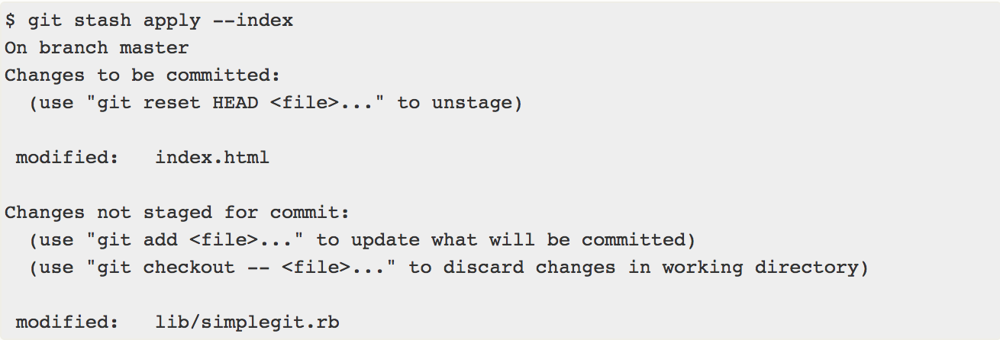

# 문제 상황

현재 브랜치에서 기능 구현을 하던 중 프론트쪽에서 이전에 작업한 api의 반환값에 특정 필드 추가를 요청했습니다. 하던 작업을 잠시 멈추고 다른 브랜치로 변경하고자 할 때 구현하던 기능이 완료되지 않아서 commit 할 수 없었습니다. 


# git stash 

아직 마무리하지 않은 작업을 스택에 잠시 저장할 수 있도록 하는 명령어 입니다. 이를 통해 아직 마무리하지 않은 일을 commit 하지 않고 잠시 스택에 저장했다가 꺼내서 마무리 할 수 있습니다. 

- git stash 명령을 사용하면 워킹 디렉토리에서 수정한 파일만 저장합니다. 

- Stash는 아래에 해당하는 파일들을 보관해두는 장소입니다.
  1) Modified이면서 Tracked 상태인 파일 (Tracked 상태의 파일을 수정한 경우)
     - Tracked: 이전에 이미 commit하여 스냅샷에 넣어진 관리대상 상태인 파일
  2) Staging Area에 있는 파일(Staged 상태의 파일)
     - Staged: git add 명령을 실행한 경우 


# 하던 작업 임시로 저장

**git stash**

새로운 stash를 스택에 만들어 하던 작업을 임시로 저장합니다. 

예시)

파일 2개를 수정하였고 그 중 하나는 **Staged 상태**이고 다른 하나는 **Modified이면서 Tracked 상태**라고 가정합니다. 

- index.html: Staging Area에 있는 파일(Staged 상태의 파일)
- lib/simplegit.rb: Modified이면서 Tracked 상태인 파일

```
// working directory에 있는 파일의 상태 확인
$ git status
Changes to be committed:
(use "git reset HEAD <file>..." to unstage)
modified:   index.html
Changes not staged for commit:
(use "git add <file>..." to update what will be committed)
(use "git checkout -- <file>..." to discard changes in working directory)
modified:   lib/simplegit.rb
```

git stash 명령을 통해 스택에 임시로 저장되고 워킹 디렉토리는 깨끗해져 다른 브랜치로 변경가능합니다. 


# stash 목록 확인

**git stash list**

여러번 stash를 했다면 이 명령어를 통해 스택에 쌓인 stash 목록을 확인할 수 있습니다.

```
$ git stash list
stash@{0}: WIP on master: 049d078 added the index file
stash@{1}: WIP on master: c264051 Revert "added file_size"
stash@{2}: WIP on master: 21d80a5 added number to log
```


# stash 적용하기(임시로 저장했던 작업 가져오기)

**git stash apply**

이 명령어를 통해 했던 작업을 다시 가져옵니다.

```
// 가장 최근의 stash를 가져와 적용한다.
$ git stash apply
// stash 이름(ex. stash@{2})에 해당하는 stash를 적용한다.
$ git stash apply [stash 이름]
```

위 명령어로는 Staged 상태였던 파일을 다시 Staged상태로 만들어 주지 않습니다. 

--index 옵션을 주어야 Staged 상태까지 복원합니다. 즉, --index 옵션을 주어야 stash 하기 이전의 원래 상태로 복원합니다.

```
// Staged 상태까지 저장
$ git stash apply --index
```


**git stash apply**


**git stash apply --index**



복원할 때 반드시 stash했을 때와 같은 브랜치일 필요는 없습니다. 만약 다른 작업 중이던 브랜치에 이전의 작업들을 추가했을 때 충돌이 있으면 알려줍니다.


# stash 제거하기

**git stash drop**

apply 는 단순히 stash 를 적용하는 것으로, 해당 stash 는 적용되어도 여전히 스택에 남아있습니다. 스택에 남아있는 stash 를 위 명령어를 통해 제거할 수 있습니다. 

```
// 가장 최근의 stash를 제거한다.
$ git stash drop
// stash 이름(ex. stash@{2})에 해당하는 stash를 제거한다.
$ git stash drop [stash 이름]
```


**git stash pop**

만약 적용과 동시에 스택에서 해당 stash를 제거하고 싶다면 위 명령어를 사용하면 됩니다.

```
// apply + drop의 형태
$ git stash pop
```


# stash 되돌리기

**git stash show -p | git apply -R**

실수로 stash 를 했을 경우 위 명령어로 되돌릴수 있습니다.

```
// 가장 최근의 stash를 사용하여 패치를 만들고 그것을 거꾸로 적용한다.
$ git stash show -p | git apply -R
// stash 이름(ex. stash@{2})에 해당하는 stash를 이용하여 거꾸로 적용한다.
$ git stash show -p [stash 이름] | git apply -R
```


alias로 쉽게 사용

```
$ git config --global alias.stash-unapply '!git stash show -p | git apply -R'
$ git stash apply
$ #... work work work
// alias로 등록한 stash 되돌리기 명령어
$ git stash-unapply
```


reference    

[참고1](https://gmlwjd9405.github.io/2018/05/18/git-stash.html)

[참고2](https://git-scm.com/book/ko/v2/Git-%EB%8F%84%EA%B5%AC-Stashing%EA%B3%BC-Cleaning)

